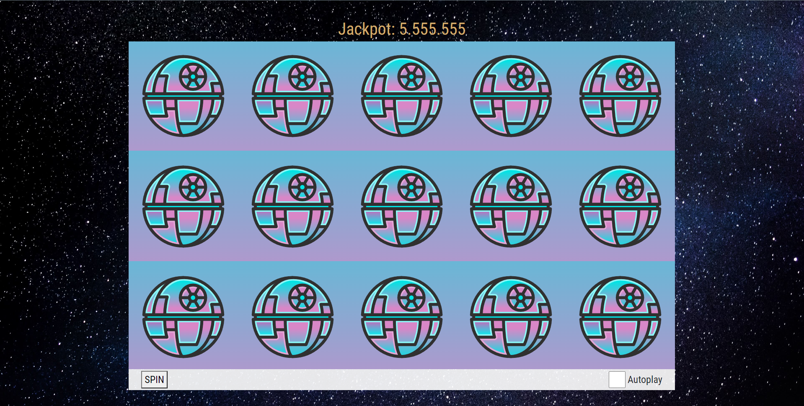

# HTML5 Slot Machine

This is a casino slot machine game, built using only vanilla HTML, CSS and JavaScript.
No Flash or Frameworks required. Allowing for an amazing low bundle size and blazing fast performance.

Built using the _Web Animations API_.

## Features

- Fully responsive for great UX on mobile, web & fullscreen mode.
- Autoplay functionality, which keeps running even if the game window is in background.

## Installation, Build & Deployment

1. Clone repository
2. Run `npm install`
   - _Development_: run `npm start` and go to `http://localhost:8080`
   - _Production_: run `npm run build` and serve from `/dist`

## Configuration

For configuration options see `config` object in [index.js](https://github.com/TomasWilliam/hiccup_git_repository/blob/master/src/js/index.js)

| Property   | Description                                                                                                                            | Default |
| ---------- | -------------------------------------------------------------------------------------------------------------------------------------- | ------- |
| `inverted` | Controls visual spinning direction of reels. If false, reels will spin from bottom to top. If true, reels will spin from top to bottom | false   |

# Sample Output
 